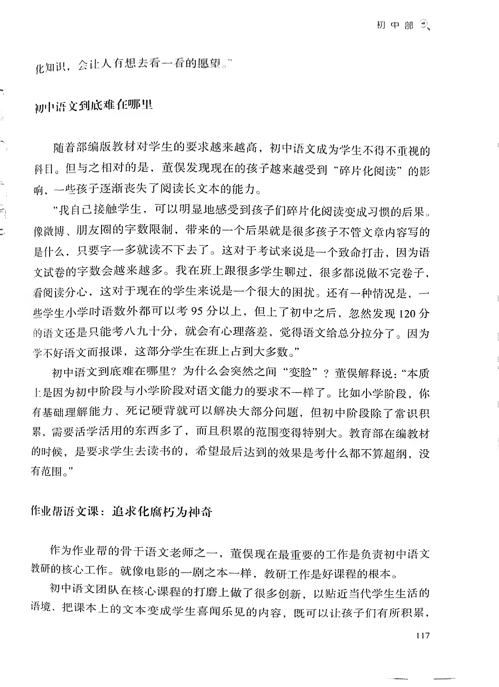
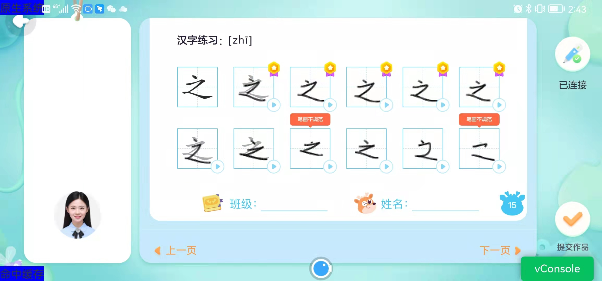
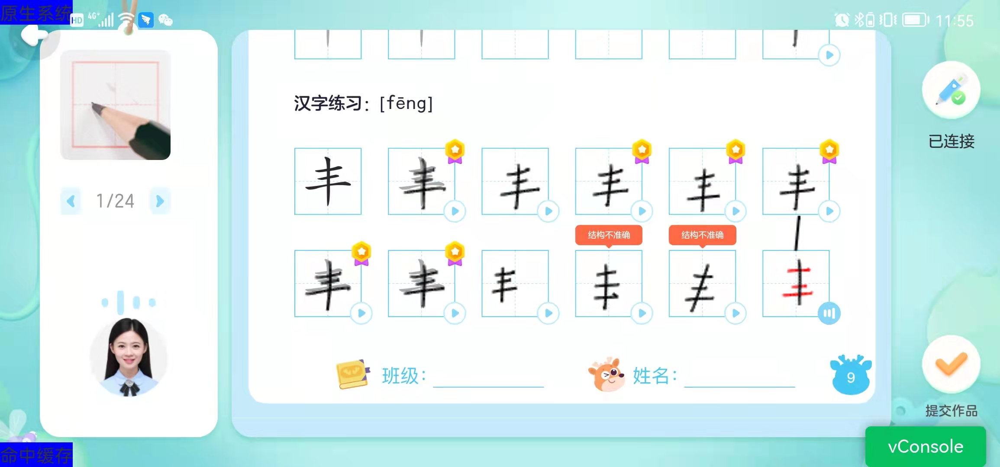
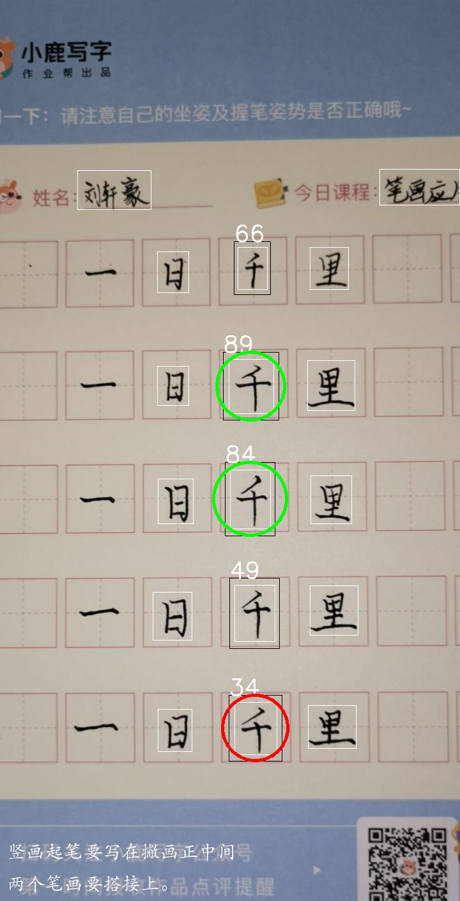
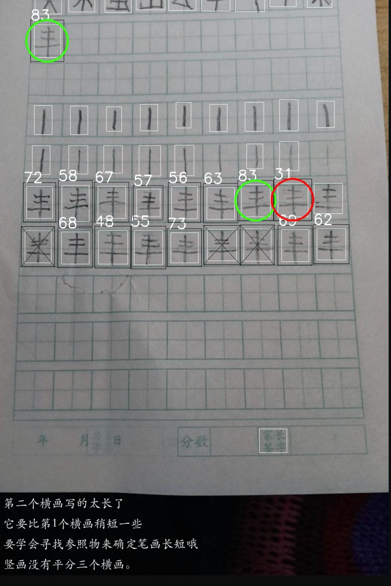
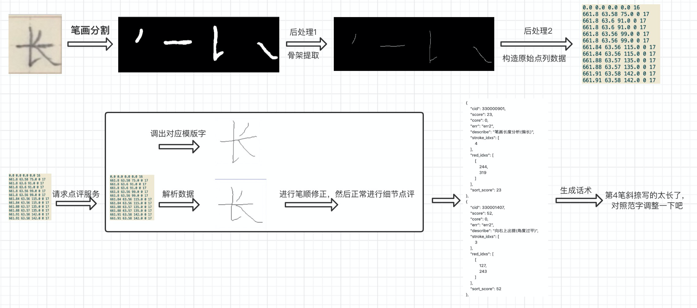

# 个人项目简介

个人项目，仅面试临时使用

本文档会对个人工作以来所做项目进行简要介绍，主要是对简历内容的一个扩充，方便面试官更清晰的了解我所做过的一些算法项目。

具体地，会按项目介绍背景、使用的技术方案、做了哪些优化、并给出一些算法效果展示的图例。

## 项目1：图像反作弊算法研发

**项目介绍**：  从0到1构建作业帮图像反作弊算法库并维护至今，提供较为全面的图像反作弊基础能力，支持公司众多图片产品线的反作弊需求和政府合规要求的快速响应，为青少年的身心健康保驾护航。

**已支持的反作弊能力主要包括**：鉴黄、涉政人物与泛娱乐人物拦截、二维码及logo等广告推广拦截、个别严重长尾case的定制化拦截等。

分项目具体介绍如下：

### 1. 鉴黄
   
技术方案：图像分类

数据集构建：数据来源包括线上命中、历史回扫、开源途径、爬虫等。

大体上经过了3个版本的迭代，使用的backbone分别为 ResNet50 -> EfficientNet-b1 -> RepVGG-B1g4

优化点：cutout、蒸馏、swa、以及多尺度等其他常规训练技巧

效果评估：迭代的第二版效果成功超过并替换数美第三方鉴黄服务，最新一次评估效果色情类别 R@P = 88.3%@99% 。

### 2.人脸识别：

背景：针对涉政违规人物和泛娱乐明星的拦截需求，开发了违规人物人脸识别系统。

技术方案：采用人脸检测+人脸特征提取+特征检索的方案。

数据集构建：数据来源包括线上数据、开源数据集vggface2、deepglint Asian和爬虫。

人脸识别模块：在FaceNet框架基础上，进行了下列改造:
- 包括将基于度量学习的triplet loss改为基于分类的arcface loss
- 对dropout rate，weight decay等人脸任务较为敏感的超参进行精细调优
- 修改人脸预处理方法
- 增加人脸对齐。

特征检索模块: 使用的开源框架faiss，索引方式为IdMap。整个部署架构上，采用了动静分离的设计，保证了人脸库稳定运行的基础上能够实现天级别的自动更新。

评估效果：涉政人物 R@P = 91.6%@99%， 明星识别 R@P = 71.6%@99%。

### 3.二维码检测：

背景与技术方案：针对二维码拦截需求，开发了二维码检测服务，服务分为检测和解析两个模块，灵活配置两个模块并结合黑白名单，可实现业务方的多样化拦截需求。

二维码检测模型使用centerNet-resnet18

二维码解析通过开源库pyzbar。

评估效果 R@P = 98.9%@99.9%。

### 4.图片黑白库：

背景与技术方案：针对部分细分场景或长尾case的反作弊需求，考虑到模型拦截的攻防成本，提出了一个类似图搜系统的解决方案，使得通过管理一个黑白库系统，以添加图片的方式，来达到长尾case的低成本自动拦截。

技术方案：采用提取图片相似性embedding+特征检索的技术方案，与人脸识别系统基本一致，embedding模型使用arcface loss的分类训练方案，特征检索模块使用faiss。

### 5.服务部署运维的建设与升级：

初期使用 tornado+pytorch/tfserving+nginx+crontab 的技术方案自行对模型服务进行维护。

后期伴随公司整体的运维升级，进行了Docker容器化改造，并将模型推理方案升级为tensorRT+triton server大幅提升QPS。

## 项目2: 文档扭曲校正

**项目背景**：文档高端化项目中的一个子任务，对用户拍照上传的整页文档中存在的扭曲进行校正。任务难点在于问题定义尚不明确、数据无法直接获取、以及预测不稳定。

**效果展示**：文档扭曲校正效果示例如下：

校正前

校正后

经过前期调研，以论文DocUNet为基础，在问题定义、数据集构建、预测稳定性等角度进行了多处优化，校正效果得到明显提升。具体地:
- 反转输出map的定义，使得后处理更加快速
- 从正反两个角度，提出了两种方法来解决扭曲数据集构建问题。
- 加入IBN模块，减少构造数据与真实数据存在gap带来的影响。
- 引入DocUNet提出的平移不变性loss，并做了一些修改
- 修改模型输出的归一化方式
- 对输出进行高斯滤波后处理
- warmup、预训练权重迭代、周期余弦学习率等训练技巧

## 项目3: 小鹿写字

**项目介绍**：开发小鹿写字AI智能点评策略系统，实现学生在使用特定硬件写字笔进行书写后，实时对汉字书写情况进行准确细致点评。历时8个月时间完成调研、开发并打磨上线，点评效果在竞品中处于第一梯队。同时，为提升课程转化率，降低人工成本，正在研发市面上第一个书法拍照点评算法，即将上线。

### 基于硬件的策略点评系统

基于硬件的智能点评策略系统，可实现包括错别字、笔画数量、笔顺、描笔、误触等通用问题的分析；以及笔画细节、笔画间关系、结构、章法等维度的细节分析。

硬件AI点评app端效果展示：

### 拍照点评算法

此外，除了基于硬件的策略点评，正在开发一个汉字书法拍照点评算法，即将上线。

拍照AI点评效果展示：

**技术方案**：算法采用 `单字检测+笔画分割+笔画轨迹提取+策略点评相结合`的技术方案。具体流程如下: 
- 首先进行一些预处理和拍照质量检测
- 通过检测模型分离出单字
- 然后通过将任务巧妙转化为多标签语义分割任务，来解决笔画分割问题。
- 通过调用自研的c++版本笔画骨架提取算法进行后处理，将分割结果转化为笔画轨迹点序列
- 进而与已有策略点评系统结合，实现基于拍照的汉字书写点评算法。

拍照点评算法流程图：

对笔画分割模型所做的优化：
- 模型采用Unet+IBN-resnet网络加强鲁棒性
- 将与当前字无关的笔画对应的输出通道忽略，不计算loss（充分利用已知信息简化问题）
- 不同笔画（通道)使用不一样的权重，重点关注难分割笔画
- 使用 focal loss 来削弱大部分易分割区域对loss的影响，提升笔画分割效果。
- 将当前文字对应范字的分割Ground Truth信息加入输出（也是充分利用已知信息简化问题，为模型提供更多先验）
- 使用类似DBNet等长文本检测模型对于label的处理方案，将笔画进行细化处理，减少粘连情况发生。

